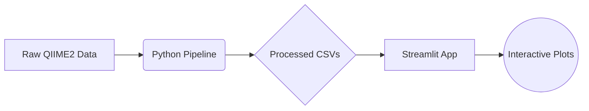

# Interactive Microbiome & Metagenomics Dashboard 🦠


## Overview
This repository contains a complete, interactive dashboard for exploring microbiome and metagenomic sequencing results. Developed by **Arshia**, this tool is designed to provide robust bioinformatics analysis with a clean, responsive user interface. The project utilizes real microbiome data to showcase taxonomic composition, alpha/beta diversity, and metadata associations.

## Scientific Motivation
Analyzing microbiome data requires making sense of massive, high-dimensional datasets. This project bridges the gap between raw sequencing outputs and biological insights by providing an interactive platform where researchers can easily drill down into taxonomic abundances and diversity metrics without needing to write code for every plot.

## Dataset
This project uses the classic **"Moving Pictures of the Human Microbiome"** dataset (Caporaso et al. 2011).
*   **Samples**: 34
*   **Metadata**: Body sites (gut, palm, tongue), subject, and timepoint.
*   **Biological Signal**: Exhibits strong differentiation in microbial composition across body sites and individuals.

## Key Features 🚀
1.  **Taxonomic Exploration**: Interactive stacked bar plots of relative abundances at multiple taxonomic levels (Phylum to Genus).
2.  **Alpha Diversity**: Boxplots comparing Shannon, Simpson, and Chao1 metrics across metadata groups.
3.  **Beta Diversity (Ordination)**: 2D and 3D Principal Coordinates Analysis (PCoA) using Bray-Curtis dissimilarity.
4.  **Sample Explorer**: Individual sample drill-downs with pie charts and tabular metadata.
5.  **Dynamic Filtering**: Instantly update all visualizations by filtering specific body sites or subjects.

## Workflow Architecture


## Installation & Reproducibility

### Local Setup
Ensure you have Python 3.10+ installed.

```bash
# Clone the repository
git clone https://github.com/yourusername/microbiome-dashboard.git
cd microbiome-dashboard

# Create and activate environment (Conda recommended)
conda env create -f environment.yml
conda activate microbiome-dashboard

# Alternatively, using pip
python -m venv venv
source venv/bin/activate  # Windows: venv\Scripts\activate
pip install -r requirements.txt
```

### Running the Data Pipeline
If you wish to recalculate the diversity metrics and re-parse the raw QIIME2 artifacts:
```bash
python src/data_processing/pipeline.py
python src/data_processing/diversity_calc.py
```

### Launching the Dashboard
```bash
streamlit run dashboard/app.py
```
The dashboard will open at `http://localhost:8501`.

## Deployment
This dashboard is optimized for deployment on **Streamlit Community Cloud**.
1. Push this repository to GitHub.
2. Sign in to [Streamlit Cloud](https://streamlit.io/cloud).
3. Click "New app" and point it to `dashboard/app.py` in your repository.
4. The environment will automatically build using `requirements.txt`.

## Project Structure
Detailed in [project_structure.md](project_structure.md).

## Limitations & Future Improvements
*   **Limitations**: The current dataset is an amplicon sequencing (16S rRNA) subset. It does not contain functional metagenomics data.
*   **Future Improvements**:
    *   Integration with differential abundance tools like DESeq2 or ANCOM-BC.
    *   Upload functionality for users to explore their own `.biom` files.

## Author
**Arshia**
*Bioinformatics Software Engineer & Data Scientist*
